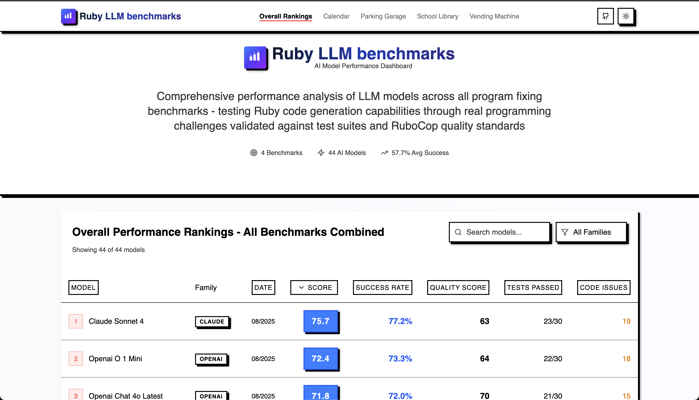

```ruby
class Reality < Exception
  def initialize
    super("Your model may be hallucinating benchmarks")
  end
end

begin
  puts "Running AI-generated code..."
  raise Reality if performance != promised_performance
rescue Reality => e
  puts "Welcome to our benchmarks!"
end
```

<div align="center">

[](LICENSE)
[](https://www.ruby-lang.org)

</div>

---

<div align="center">

### 🧪 Where AI Models Come to Face Their `RuntimeError`s

</div>

<div align="center">



 [**🌐 Interactive Results Website**](https://benchmarks.oskarsezerins.site/)

_See real-time rankings, detailed metrics, and comprehensive analysis of AI model performance across all benchmark types_

</div>

## Requirements

```ruby
unless RUBY_VERSION >= "3.4.0"
  puts "⚠️ Hold up! We need Ruby 3.4+ for this party! ⚠️"
  exit
end

puts "✨ You're good to go! Let's benchmark some AI! ✨"
```

## Features

```ruby
module BenchmarkFeatures
  class << self
    def dual_benchmark_types
      # Two comprehensive benchmark categories
      {
        performance: "⚡️ Raw speed & memory efficiency tests",
        program_fixer: "🛠️ AI debugging & code repair challenges"
      }
    end

    def automated_testing
      # One command for both running benchmarks and generating implementations
      system("bin/main")
    end

    def implementation_generation
      # Automatic implementation generation with OpenRouter models
      # powered by ruby_llm gem
      available_models = true
      easy_setup = true
      consistent_results = true

      puts "✨ AI-powered solution generation" if available_models && easy_setup && consistent_results
    end

    def interactive_website
      # Modern React Router website for exploring results
      {
        real_time_rankings: true,
        detailed_metrics: true,
        model_comparisons: true,
        benchmark_insights: true
      }
    end

    def fair_competition
      models.each do |model|
        # Each model gets the same prompt
        # Each implementation is saved with a timestamp
        # Results are tracked and compared consistently
      end
    end

    def comprehensive_metrics
      {
        performance: {
          speed: "⚡️ Microseconds matter",
          memory: "🧠 Every byte counts",
          complexity: "🤯 O(n) or go home"
        },
        program_fixer: {
          test_success: "✅ Tests passing ratio",
          syntax_validity: "� Clean, compilable code",
          rubocop_score: "💎 Ruby style compliance"
        }
      }
    end

    def transparency
      open_source = true
      results_public = true
      bias = nil # We don't do that here

      puts "Trust through code, not words" if open_source && results_public && bias.nil?
    end

    private

    def marketing_buzz
      raise NotImplementedError, "We prefer cold, hard benchmarks"
    end
  end
end

# No AI models were permanently harmed in the making of these benchmarks
# (They just learned some humility)
```

## Quick Start

```bash
# Clone this beauty
git clone https://github.com/OskarsEzerins/llm-benchmarks
cd llm-benchmarks

# Install dependencies
bundle install

# Choose your adventure 🎮
bin/main

# Interactive menu with options:
# 1. 🏃‍♂️ Run benchmarks with existing implementations
#    - Performance benchmarks (speed & memory)
#    - Program fixer benchmarks (debugging challenges)
# 2. 🤖 Generate new AI implementations with OpenRouter models
#    - 44+ models available
#    - Automated prompt-to-implementation pipeline

# See detailed results by category
bin/show_all_results

# See combined rankings across all benchmark types
bin/show_total_rankings

# 🌐 Launch the website locally (optional)
cd website
pnpm install
pnpm dev
```

## Ways to Contribute

```ruby
if you.have_ideas? && you.like_benchmarks?
  puts "We'd love your help!"
  fork_it
  create_branch
  push_changes
  pull_request
else
  puts "No pressure! Star us and come back later!"
end
```

- **Add new model implementations**: Run a model against all benchmarks and open a PR with the results. See [#19](https://github.com/OskarsEzerins/llm-benchmarks/pull/19/files) as an example.
- **Add new benchmark types**: Got a clever challenge for AI models?
- **Improve the website**: Make those charts even prettier
- **Optimize benchmarks**: More accurate, more fair, more challenging
- **Documentation**: Help others understand the madness

## Project Anatomy

```
📦 LLM_BENCHMARKS
 ┣ 📂 benchmarks      # Where AI models face their destiny
 ┃ ┣ 📂 performance   # ⚡️ Speed & memory challenges
 ┃ ┗ 📂 program_fixer # 🛠️ Code debugging challenges
 ┣ 📂 implementations # AI's best attempts at glory
 ┃ ┣ 📂 performance   # Generated speed solutions
 ┃ ┗ 📂 program_fixer # Generated debugging fixes
 ┣ 📂 lib             # Our benchmark orchestration tools
 ┣ 📂 results         # The cold, hard truth (JSON data)
 ┣ 📂 website         # 🌐 Interactive results dashboard
 ┗ 📂 bin             # Press buttons, get answers
```

### Benchmark Types

**Performance Benchmarks** ⚡️

- CSV data processing at scale
- Graph shortest path algorithms
- LRU cache implementations
- Run-length encoding optimization

**Program Fixer Benchmarks** 🛠️

- Calendar system debugging
- Parking garage logic repair
- School library management fixes
- Vending machine state handling

---

<div align="center">

### 🔬 `assert_equal(ai_promises, reality)`

_Where AI code meets its maker... literally_

**Built with ❤️ by developers who believe in transparency over hype**

</div>
